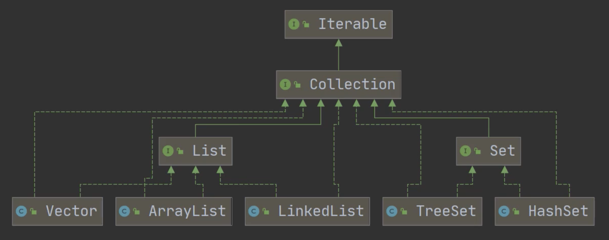
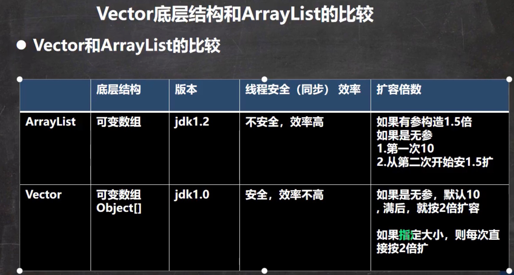
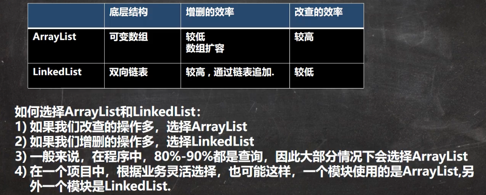

#Collection 结构图

#List
##ArrayList
###Tips
1. ArraysList 可以add放入空值
2. ArraysList 是(线程不安全)的，所以效率高, 基本等同与Vector(线程安全)
3. 初始数组是obj数组 elementData (特殊情况容量为0 即new ArrayList() 第一次扩容为10)， 之后为1.5倍

###源码
1. 原始数组 Object[] elementData
2. size 是 原始数组 elementData的size
3. minCapacity 是目前使用到的大小，即add()到的size

##LinkedList
 
 
 

