#Set

##Set接口常用方法
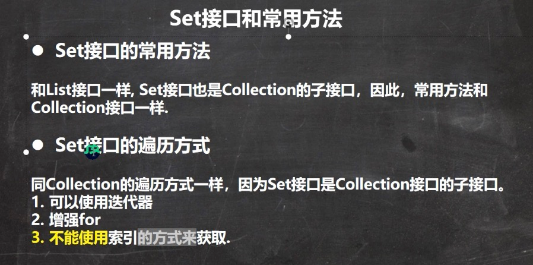

##HashSet
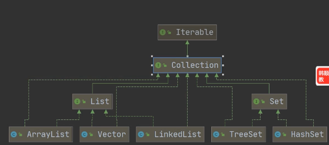
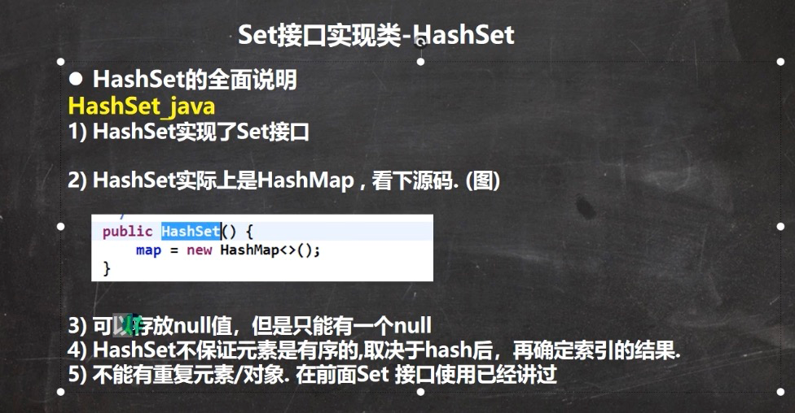

##HashSet底层
本质上就是HashMap
set.add("a") <==> map.put("a",PRESENT)
这里PRESENT就是一个 static final的object
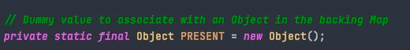
##HashSet数据结构的作用
提升存储效率
##HashSet扩容机制
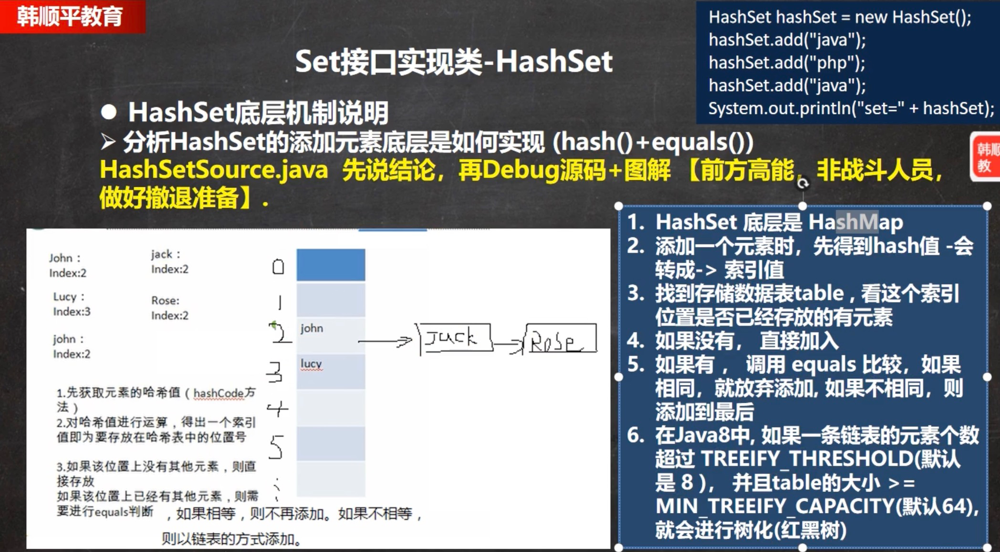
*修改 TREEIFY_THRESHOLD >=8个 && table到MIN__TREEIFY_CAPACITY(64) => TREEIFY
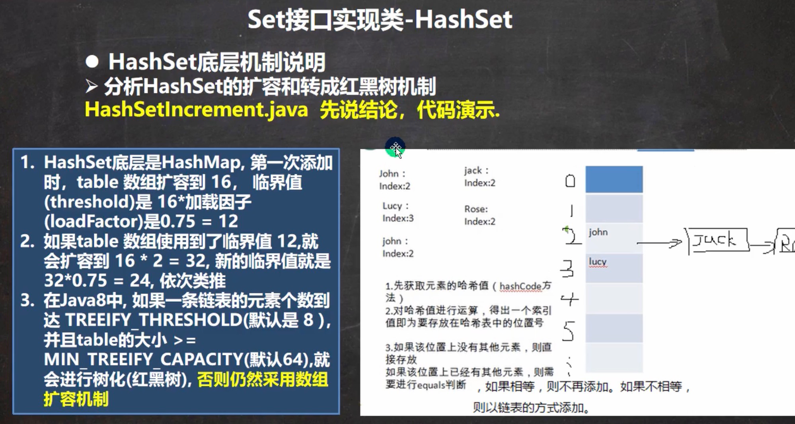
####notes
此处size是add的所有节点数量，不是数组tab[]被占用的节点
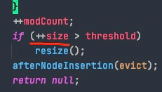

e.g. 初始情况数组容量16，loadFactor之后即12，只要加到第12个时，数组容量就会翻倍，即24 
###new HashSet() 第一次add
1. putVal
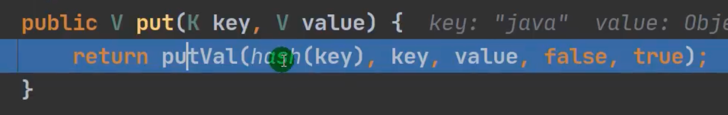
2. compute hashVal
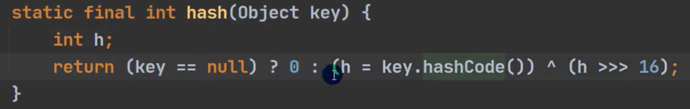
3. initial table 
DEFAULT_INITIAL_CAPACITY  1<<4 = 16 
DEFAULT_LOAD_FACTOR 0.75 防止在增加数据量比较大到情况下需要扩容，提前缓冲扩容(即16的情况下 到12 就开始扩容)
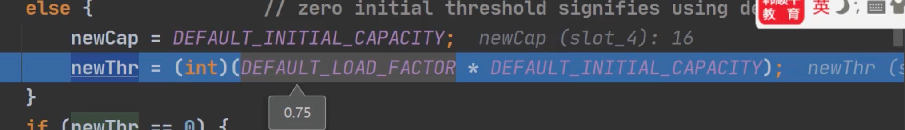 
4. compute where to put node in this table
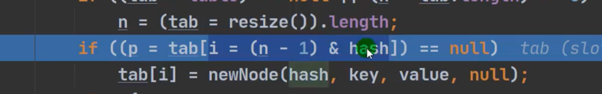
5. Add successfully (添加成功返回null)
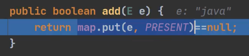
###第二次add值(假设与第一次一样) 
1. 重复第一次add的 1，2 操作
2. 由于hash值相等进入else判断
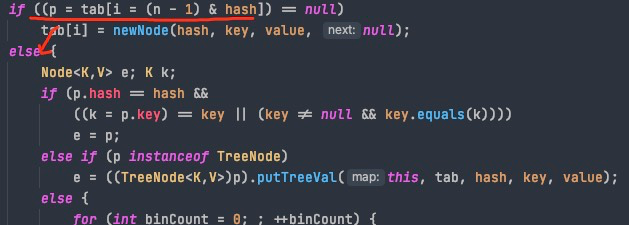
   1. 调用equals方法判断
   2. 判断tab[i]处节点是否为树的跟节点，即判断该链条是否TREEIFY,如果是则加入该节点到树
   3. 遍历该链表，判断是否需要加入
    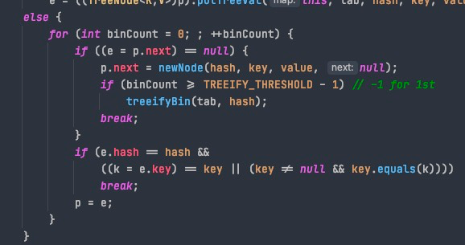
      
##LinkedHashSet
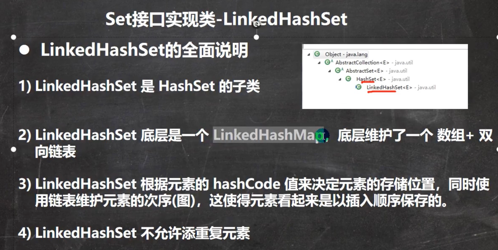
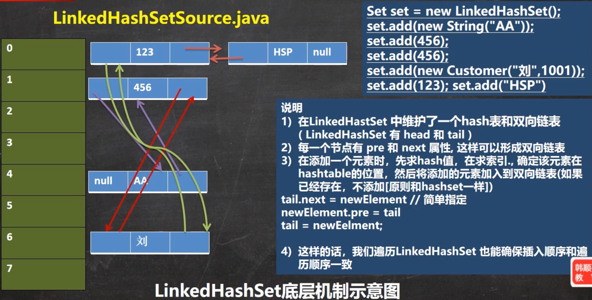
